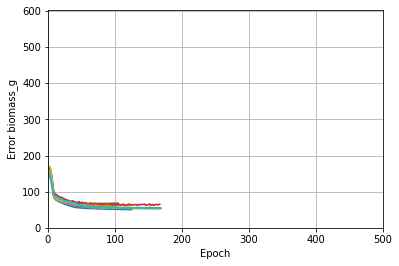
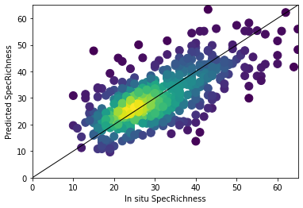
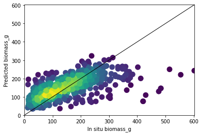

## Calibration and evaluation of DNN model

Created on Aug 09 09:29:22 2022
@author: Javier Muro

This code trains a feed forward neural network (modelDNN.py and gkfold_DNN.py) to predict either biomass or species richness.

be_preprocessing.py moduls preprocess the data frame

We can also use a a random forest (gkfold_RF.py) instead of the nn for comparison purposes.
 
Training and validation points are distributed grouping the replicates to avoid spatial and temporal dependencies. 

Alternatively, the user can perform a spatial cross-validation, selecting
two regions for training and the remaining region for validation.

Machine learning terminology found across tutorials and courses: 

1.   Validation dataset: part of the training dataset used by model to fine tune itself and by you to fine tune predictors and hyper parameters (e.g. epochs, activation function, number of layers...). Set in validation_split when applying the .fit function.

2.   Test dataset: datset never seen by model. Used to evaluate final model's accuracy once hyperparameters and predictors have been determined.

3.   Labels: 'y', study variable, dependent or response variable

4.   Features: 'x', predictors

Dataframe contains grassland vegetation information collected over three regions in Germany. Each region has 50 plots, and each plot is sampled in May for 4 years: 2017-2020


Predictors are the interpolated spectral data from the 10 bands of Sentinel-2 at 16 time stamps: from April to October, every 14 days.


## Import libraries and data


```python
from __future__ import absolute_import, division, print_function, unicode_literals

import matplotlib.pyplot as plt
import numpy as np
import pandas as pd
import seaborn as sns
import scipy as sp
import statistics
import math

from keras.utils.vis_utils import plot_model

from google.colab import drive, files
```

Mount google drive to access dataset


```python
drive.mount('/content/drive')
```

    Mounted at /content/drive
    

Change working directory to a folder in your drive. We will clone my repository there.


```python
%cd .'/drive/MyDrive/SEBAS/Pyproject_modules/SeBAS_project_github/'
```

    /content/drive/MyDrive/SEBAS/Pyproject_modules/SeBAS_project_github
    

Clone my repository, initialize it, add origin and pull to access all the files


```python
! git clone https://github.com/Havi-muro/SeBAS_project.git
```

    Cloning into 'SeBAS_project'...
    remote: Enumerating objects: 338, done.
    remote: Counting objects: 100% (255/255), done.
    remote: Compressing objects: 100% (178/178), done.
    remote: Total 338 (delta 139), reused 187 (delta 74), pack-reused 83
    Receiving objects: 100% (338/338), 109.49 MiB | 12.71 MiB/s, done.
    Resolving deltas: 100% (171/171), done.
    Checking out files: 100% (88/88), done.
    


```python
! git init
```

    Initialized empty Git repository in /content/drive/MyDrive/SEBAS/Pyproject_modules/SeBAS_project_github/.git/
    


```python
! git remote add origin https://github.com/Havi-muro/SeBAS_project.git
```


```python
! git pull
```

    remote: Enumerating objects: 338, done.
    remote: Counting objects: 100% (255/255), done.
    remote: Compressing objects: 100% (178/178), done.
    remote: Total 338 (delta 139), reused 187 (delta 74), pack-reused 83
    Receiving objects: 100% (338/338), 109.49 MiB | 12.54 MiB/s, done.
    Resolving deltas: 100% (171/171), done.
    From https://github.com/Havi-muro/SeBAS_project
     * [new branch]      main       -> origin/main
    There is no tracking information for the current branch.
    Please specify which branch you want to merge with.
    See git-pull(1) for details.
    
        git pull <remote> <branch>
    
    If you wish to set tracking information for this branch you can do so with:
    
        git branch --set-upstream-to=origin/<branch> master
    
    

Change the working directory again to the repository folder


```python
%cd SeBAS_project
```

    /content/drive/MyDrive/SEBAS/Pyproject_modules/SeBAS_project_github/SeBAS_project
    


```python
Mydataset_0 = pd.read_csv('data/Bexis_Sentinels_full_dataset.csv') 
```

## Explore and prepare the data

Visualize response variables and predictors.


```python
print(list(Mydataset_0.columns))
```

    ['Year', 'ep', 'yep', 'explo', 'x', 'y', 'number_vascular_plants', 'SpecRichness', 'height_cm', 'biomass_g', 'NMDS1', 'NMDS2', 'SpecRich_157', 'Shannon_157', 'Simpson_157', 'inverse_Simpson_157', 'PielouEvenness_157', 'Rao_Q_157', 'Redundancy_157', 'Shannon', 'Simpson', 'FisherAlpha', 'PielouEvenness', 'LUI_2015_2018', 'SoilTypeFusion', 'slope', 'aspect', 'LAI', 'blue', 'green', 'red', 'nir', 'nirb', 're1', 're2', 're3', 'swir1', 'swir2', 'EVI', 'SAVI', 'GNDVI', 'ARVI', 'CHLRE', 'MCARI', 'NDII', 'MIRNIR', 'MNDVI', 'NDVI', 'VHMean_May', 'VVMean_May', 'VVVH', 'TWI', 'blue_0', 'green_0', 'red_0', 'nir_0', 'nirb_0', 're1_0', 're2_0', 're3_0', 'swir1_0', 'swir2_0', 'blue_1', 'green_1', 'red_1', 'nir_1', 'nirb_1', 're1_1', 're2_1', 're3_1', 'swir1_1', 'swir2_1', 'blue_2', 'green_2', 'red_2', 'nir_2', 'nirb_2', 're1_2', 're2_2', 're3_2', 'swir1_2', 'swir2_2', 'blue_3', 'green_3', 'red_3', 'nir_3', 'nirb_3', 're1_3', 're2_3', 're3_3', 'swir1_3', 'swir2_3', 'blue_4', 'green_4', 'red_4', 'nir_4', 'nirb_4', 're1_4', 're2_4', 're3_4', 'swir1_4', 'swir2_4', 'blue_5', 'green_5', 'red_5', 'nir_5', 'nirb_5', 're1_5', 're2_5', 're3_5', 'swir1_5', 'swir2_5', 'blue_6', 'green_6', 'red_6', 'nir_6', 'nirb_6', 're1_6', 're2_6', 're3_6', 'swir1_6', 'swir2_6', 'blue_7', 'green_7', 'red_7', 'nir_7', 'nirb_7', 're1_7', 're2_7', 're3_7', 'swir1_7', 'swir2_7', 'blue_8', 'green_8', 'red_8', 'nir_8', 'nirb_8', 're1_8', 're2_8', 're3_8', 'swir1_8', 'swir2_8', 'blue_9', 'green_9', 'red_9', 'nir_9', 'nirb_9', 're1_9', 're2_9', 're3_9', 'swir1_9', 'swir2_9', 'blue_10', 'green_10', 'red_10', 'nir_10', 'nirb_10', 're1_10', 're2_10', 're3_10', 'swir1_10', 'swir2_10', 'blue_11', 'green_11', 'red_11', 'nir_11', 'nirb_11', 're1_11', 're2_11', 're3_11', 'swir1_11', 'swir2_11', 'blue_12', 'green_12', 'red_12', 'nir_12', 'nirb_12', 're1_12', 're2_12', 're3_12', 'swir1_12', 'swir2_12', 'blue_13', 'green_13', 'red_13', 'nir_13', 'nirb_13', 're1_13', 're2_13', 're3_13', 'swir1_13', 'swir2_13', 'blue_14', 'green_14', 'red_14', 'nir_14', 'nirb_14', 're1_14', 're2_14', 're3_14', 'swir1_14', 'swir2_14', 'blue_15', 'green_15', 'red_15', 'nir_15', 'nirb_15', 're1_15', 're2_15', 're3_15', 'swir1_15', 'swir2_15', 'S2Q', 'S2QF']
    


```python
Mydataset_0.head(5)
```


  <div id="df-1e67fd07-8121-4c72-bc44-6d415967efc6">
    <div class="colab-df-container">
      <div>
<style scoped>
    .dataframe tbody tr th:only-of-type {
        vertical-align: middle;
    }

    .dataframe tbody tr th {
        vertical-align: top;
    }

    .dataframe thead th {
        text-align: right;
    }
</style>
<table border="1" class="dataframe">
  <thead>
    <tr style="text-align: right;">
      <th></th>
      <th>Year</th>
      <th>ep</th>
      <th>yep</th>
      <th>explo</th>
      <th>x</th>
      <th>y</th>
      <th>number_vascular_plants</th>
      <th>SpecRichness</th>
      <th>height_cm</th>
      <th>biomass_g</th>
      <th>...</th>
      <th>red_15</th>
      <th>nir_15</th>
      <th>nirb_15</th>
      <th>re1_15</th>
      <th>re2_15</th>
      <th>re3_15</th>
      <th>swir1_15</th>
      <th>swir2_15</th>
      <th>S2Q</th>
      <th>S2QF</th>
    </tr>
  </thead>
  <tbody>
    <tr>
      <th>0</th>
      <td>2017</td>
      <td>AEG01</td>
      <td>012017ALB</td>
      <td>ALB</td>
      <td>525313</td>
      <td>5360594</td>
      <td>14.0</td>
      <td>33.0</td>
      <td>13.38</td>
      <td>153.25</td>
      <td>...</td>
      <td>418.0</td>
      <td>4564.0</td>
      <td>4418.0</td>
      <td>1368.0</td>
      <td>3778.0</td>
      <td>4277.0</td>
      <td>2138.0</td>
      <td>955.0</td>
      <td>0.680651</td>
      <td>0.656078</td>
    </tr>
    <tr>
      <th>1</th>
      <td>2017</td>
      <td>AEG02</td>
      <td>022017ALB</td>
      <td>ALB</td>
      <td>535010</td>
      <td>5358415</td>
      <td>12.0</td>
      <td>21.0</td>
      <td>18.75</td>
      <td>164.75</td>
      <td>...</td>
      <td>404.0</td>
      <td>3988.0</td>
      <td>3931.0</td>
      <td>1152.0</td>
      <td>3123.0</td>
      <td>3695.0</td>
      <td>1968.0</td>
      <td>915.0</td>
      <td>0.976994</td>
      <td>0.359795</td>
    </tr>
    <tr>
      <th>2</th>
      <td>2017</td>
      <td>AEG03</td>
      <td>032017ALB</td>
      <td>ALB</td>
      <td>539398</td>
      <td>5370311</td>
      <td>18.0</td>
      <td>35.0</td>
      <td>4.53</td>
      <td>66.60</td>
      <td>...</td>
      <td>506.0</td>
      <td>3242.0</td>
      <td>3053.0</td>
      <td>1157.0</td>
      <td>2526.0</td>
      <td>2891.0</td>
      <td>2050.0</td>
      <td>1009.0</td>
      <td>0.677909</td>
      <td>0.485461</td>
    </tr>
    <tr>
      <th>3</th>
      <td>2017</td>
      <td>AEG04</td>
      <td>042017ALB</td>
      <td>ALB</td>
      <td>531016</td>
      <td>5359610</td>
      <td>14.0</td>
      <td>22.0</td>
      <td>19.75</td>
      <td>189.50</td>
      <td>...</td>
      <td>443.0</td>
      <td>4101.0</td>
      <td>3999.0</td>
      <td>1239.0</td>
      <td>3231.0</td>
      <td>3760.0</td>
      <td>2238.0</td>
      <td>1077.0</td>
      <td>0.700765</td>
      <td>0.802787</td>
    </tr>
    <tr>
      <th>4</th>
      <td>2017</td>
      <td>AEG05</td>
      <td>052017ALB</td>
      <td>ALB</td>
      <td>532511</td>
      <td>5359895</td>
      <td>17.0</td>
      <td>20.0</td>
      <td>15.25</td>
      <td>195.25</td>
      <td>...</td>
      <td>324.0</td>
      <td>4997.0</td>
      <td>4810.0</td>
      <td>1166.0</td>
      <td>3875.0</td>
      <td>4636.0</td>
      <td>2086.0</td>
      <td>908.0</td>
      <td>0.724976</td>
      <td>0.789717</td>
    </tr>
  </tbody>
</table>
<p>5 rows × 214 columns</p>
</div>
      <button class="colab-df-convert" onclick="convertToInteractive('df-1e67fd07-8121-4c72-bc44-6d415967efc6')"
              title="Convert this dataframe to an interactive table."
              style="display:none;">

  <svg xmlns="http://www.w3.org/2000/svg" height="24px"viewBox="0 0 24 24"
       width="24px">
    <path d="M0 0h24v24H0V0z" fill="none"/>
    <path d="M18.56 5.44l.94 2.06.94-2.06 2.06-.94-2.06-.94-.94-2.06-.94 2.06-2.06.94zm-11 1L8.5 8.5l.94-2.06 2.06-.94-2.06-.94L8.5 2.5l-.94 2.06-2.06.94zm10 10l.94 2.06.94-2.06 2.06-.94-2.06-.94-.94-2.06-.94 2.06-2.06.94z"/><path d="M17.41 7.96l-1.37-1.37c-.4-.4-.92-.59-1.43-.59-.52 0-1.04.2-1.43.59L10.3 9.45l-7.72 7.72c-.78.78-.78 2.05 0 2.83L4 21.41c.39.39.9.59 1.41.59.51 0 1.02-.2 1.41-.59l7.78-7.78 2.81-2.81c.8-.78.8-2.07 0-2.86zM5.41 20L4 18.59l7.72-7.72 1.47 1.35L5.41 20z"/>
  </svg>
      </button>

  <style>
    .colab-df-container {
      display:flex;
      flex-wrap:wrap;
      gap: 12px;
    }

    .colab-df-convert {
      background-color: #E8F0FE;
      border: none;
      border-radius: 50%;
      cursor: pointer;
      display: none;
      fill: #1967D2;
      height: 32px;
      padding: 0 0 0 0;
      width: 32px;
    }

    .colab-df-convert:hover {
      background-color: #E2EBFA;
      box-shadow: 0px 1px 2px rgba(60, 64, 67, 0.3), 0px 1px 3px 1px rgba(60, 64, 67, 0.15);
      fill: #174EA6;
    }

    [theme=dark] .colab-df-convert {
      background-color: #3B4455;
      fill: #D2E3FC;
    }

    [theme=dark] .colab-df-convert:hover {
      background-color: #434B5C;
      box-shadow: 0px 1px 3px 1px rgba(0, 0, 0, 0.15);
      filter: drop-shadow(0px 1px 2px rgba(0, 0, 0, 0.3));
      fill: #FFFFFF;
    }
  </style>

      <script>
        const buttonEl =
          document.querySelector('#df-1e67fd07-8121-4c72-bc44-6d415967efc6 button.colab-df-convert');
        buttonEl.style.display =
          google.colab.kernel.accessAllowed ? 'block' : 'none';

        async function convertToInteractive(key) {
          const element = document.querySelector('#df-1e67fd07-8121-4c72-bc44-6d415967efc6');
          const dataTable =
            await google.colab.kernel.invokeFunction('convertToInteractive',
                                                     [key], {});
          if (!dataTable) return;

          const docLinkHtml = 'Like what you see? Visit the ' +
            '<a target="_blank" href=https://colab.research.google.com/notebooks/data_table.ipynb>data table notebook</a>'
            + ' to learn more about interactive tables.';
          element.innerHTML = '';
          dataTable['output_type'] = 'display_data';
          await google.colab.output.renderOutput(dataTable, element);
          const docLink = document.createElement('div');
          docLink.innerHTML = docLinkHtml;
          element.appendChild(docLink);
        }
      </script>
    </div>
  </div>


Plot a couple of variables against each other


```python
sns.pairplot(Mydataset_0[['nir_4','biomass_g']], diag_kind="biomass_g")
```


    <seaborn.axisgrid.PairGrid at 0x7f55d4a58fd0>


    

    


Select the study variable ('biomass_g' or 'SpecRichness') and run the preprocesing module. We can change the predictors used within this module. It returns two dataframes, one to analyze, and another one with relevant environmental information to color the predictions vs labels plots later on.


```python
studyvar = 'biomass_g'
import be_preprocessing
```

Create datasets needed in the global environment. MydatasetLUI is contains information on land use intensity, in case we want to plot predicted vs in situ, color coded by land use


```python
Mydataset = be_preprocessing.be_preproc(studyvar)[0]

MydatasetLUI = be_preprocessing.be_preproc(studyvar)[1]
print(Mydataset.head())
print(list(Mydataset.columns))
```

          ep  biomass_g   blue  green    red     nir    nirb     re1     re2  \
    0  AEG01     153.25  345.0  708.0  434.0  4232.0  4098.0  1159.0  3351.0   
    1  HEG01      93.60  344.0  709.0  410.0  4444.0  4301.0  1096.0  3369.0   
    2  SEG01     173.30  274.0  609.0  319.0  4079.0  3960.0  1010.0  3110.0   
    3  AEG01     197.50  360.0  703.0  471.0  4577.0  4351.0  1072.0  3441.0   
    4  HEG01     128.90  376.0  758.0  474.0  4068.0  3868.0  1163.0  3089.0   
    
          re3   swir1   swir2  
    0  3967.0  1976.0   950.0  
    1  4125.0  1900.0   901.0  
    2  3731.0  1753.0   798.0  
    3  4168.0  2082.0   946.0  
    4  3685.0  2086.0  1018.0  
    ['ep', 'biomass_g', 'blue', 'green', 'red', 'nir', 'nirb', 're1', 're2', 're3', 'swir1', 'swir2']
    

##Run the DNN model

The data contain replicates (4 observations per plot, one per year during 4 years). Thus, we have to ensure that all replicates are always in the same fold. For that, gkfold_DNN.py groups the observations by plot. The gkfold_DNN.py module uses the modelDNN.py module, which contains the architecture of the DNN. It uses also plot_loss.py that displays the loss function across epochs. We build a df with the predictions for the 5 folds and link them to the original dataset


```python
import gkfold_DNN

EPOCHS = 500

gkfold_DNN.gkfold_DNN(EPOCHS, studyvar)

# build a df of the accumulated predictions vs labels
pred_trues = gkfold_DNN.pred_trues
pred_truesdf = pd.concat(pred_trues)

# build also a df with the test features in the order in which they were split
testfeatures_order = gkfold_DNN.testfeatures_order2
testfeatures_orderdf = pd.concat(testfeatures_order)

# concatenate both laterally. They should correspond.
rsdf = pd.concat([testfeatures_orderdf, pred_truesdf], axis=1)

# merge it with the original dataset using the features as joining field
# This allows us to display preds vs lables along with other variables
Mypredictions = pd.merge(rsdf, MydatasetLUI)
```

    Fold#1
    Epoch 126: early stopping
    Fold#2
    Epoch 168: early stopping
    Fold#3
    Epoch 106: early stopping
    Fold#4
    Epoch 167: early stopping
    Fold#5
    Epoch 170: early stopping
    


    

    


The plot above shows the accumulated loss and validation_loss functions for the five folds.

##Plot results

Plot predictions versus labels using a density plot


```python
#Make a density plot
from scipy.stats import gaussian_kde

y = Mypredictions['preds']#.astype(float)
x = Mypredictions['labels']

# Calculate the point density
xy = np.vstack([x,y])
z = gaussian_kde(xy)(xy)

fig, ax = plt.subplots()
ax.scatter(x, y, c=z, s=100)

#plt.xlabel('Biomass $(g/m^{2})$')
#plt.ylabel('Predicted biomass $(g/m^{2})$')
plt.ylabel(f'Predicted {studyvar}')
plt.xlabel(f'In situ {studyvar}')
plt.xlim(0, max(Mydataset[studyvar]))
plt.ylim(0, max(Mydataset[studyvar]))
#add a r=1 line
line = np.array([0,max(Mydataset[studyvar])])
plt.plot(line,line,lw=1, c="black")
plt.show()
```


    

    


```python
#fig.savefig('sppRich_2022.png')
#files.download('sppRich_2022.png')
```


    <IPython.core.display.Javascript object>


    <IPython.core.display.Javascript object>


Plot predictions vs labels colored by some field such as LUI


```python
Mypredictions = Mypredictions.rename(columns = {'LUI_2015_2018':'LUI'})

# Plot predictions color coded with LUI
myplot = sns.scatterplot(data=Mypredictions,
                         y='preds',
                         x=studyvar,
                         hue = 'LUI', 
                         palette='viridis',
                         #cmap = 'Reds',
                         linewidth=0,
                         s = 20
                         )
plt.ylabel(f'{studyvar} Predicted')
plt.xlabel(f'{studyvar} insitu values')
myplot.legend(title="LUI")
plt.xlim(0, max(Mydataset[studyvar]))
plt.ylim(0, max(Mydataset[studyvar]))

#add a r=1 line
line = np.array([0,max(Mydataset[studyvar])])
plt.plot(line,line,lw=1, c="black")
plt.show()
#fig.savefig(f'{studyvar}allfolds_plot2.svg')
```


    

    


Another way to plot results using the compiled df of predictions vs labels


```python
"""
% Matlab function to calculate model evaluation statistics 
% S. Robeson, November 1993
% Author of matlab function: Zbynek Malenovksy

% zb(1):  mean of observed variable 
% zb(2):  mean of predicted variable 
% zb(3):  std dev of observed variable 
% zb(4):  std dev of predicted variable 
% zb(5):  correlation coefficient
% zb(6):  intercept of OLS regression
% zb(7):  slope of OLS regression
% zb(8):  mean absolute error (MAE)
% zb(9):  index of agreement (based on MAE)
% zb(10): root mean squared error (RMSE)
% zb(11): relative root mean squared error (RMSE)
% zb(12): RMSE, systematic component
% zb(13): RMSE, unsystematic component
% zb(14): index of agreement (based on RMSE)

""" 
# I have to import in each iteration
import gkfold_DNN 
# import kfold_RF
met_ls=[]
for i in range(3):
    
    EPOCHS = 500
    
    # We build a df of the accumulated predictions vs labels
    # for DNN or RF

    gkfold_DNN.gkfold_DNN(EPOCHS, studyvar)
    pred_trues = gkfold_DNN.pred_trues

    #kfold_RF.kfold_RF(studyvar)
    #pred_trues = kfold_RF.pred_trues
    
    pred_truesdf = pd.concat(pred_trues).reset_index(drop=True)
    
    # Select the last batch of predictions.
    # Predictions accumulate when we iterate 10 times
    # even if we delete all the variables
    pred_truesdf = pred_truesdf.tail(Mydataset.shape[0])
    
    # Predictions vs labels
    y = pred_truesdf['preds']
    x = pred_truesdf['labels']
    
    # Calculate the point density
    xy = np.vstack([x,y])
    z = gaussian_kde(xy)(xy)
    
    fig, ax = plt.subplots()
    ax.scatter(x, y, c=z, s=100)
    
    plt.ylabel(f'Predicted {studyvar}')
    plt.xlabel(f'In situ {studyvar}')
    plt.xlim(0, max(Mydataset[studyvar]))
    plt.ylim(0, max(Mydataset[studyvar]))
    # add a r=1 line
    line = np.array([0,max(Mydataset[studyvar])])
    plt.plot(line,line,lw=1, c="black")
    plt.show()
    
    # Calculate additional metrics
    n = len(x)
    so = x.sum()
    sp = y.sum()
    
    sumo2 = (x**2).sum()
    sump2 = (y**2).sum()
    
    sum2 = ((x-y)**2).sum()
    sumabs = abs(x-y).sum()
    
    sumdif = (x-y).sum()
    cross = (x*y).sum()
    
    obar = x.mean()
    pbar = y.mean()
    
    sdo = math.sqrt(sumo2/n - obar*obar)
    sdp = math.sqrt(sump2/n-pbar*pbar)
    c = cross/n - obar*pbar
    r = c/(sdo*sdp)
    r2 = r**2
    b = r*sdp/sdo
    a = pbar - b*obar
    mse = sum2/n
    mae = sumabs/n
    
    msea = a**2
    msei = 2*a*(b-1)*obar
    msep = ((b-1)**2) *sumo2/n
    mses = msea + msei + msep
    mseu = mse - mses
    
    rmse = math.sqrt(mse)
    rrmse = rmse/obar
    rmses = math.sqrt(mses)
    rmseu = math.sqrt(mseu)
        
    pe1 = (abs(y-obar) + abs(x-obar)).sum()
    pe2 = ((abs(y-obar) + abs(x-obar))**2).sum()
    d1 = 1 - n*mae/pe1;
    d2 = 1 - n*mse/pe2;
    
    zb = [obar,pbar,sdo,sdp,r,a,b,mae,d1,rmse,rrmse,rmses,rmseu,d2]
    
    results = [r2, rrmse, rmses, rmseu]
    
    met_ls.append(results)
```


```python
# Check that length = number of loops    
len(met_ls)
```


    3


Calculate mean and standard deviation over the k folds performed


```python
r2_hat = statistics.mean([x[0] for x in met_ls])
r2_sd = statistics.pstdev([x[0] for x in met_ls])

rrmse_hat = statistics.mean([x[1] for x in met_ls])
rrmse_sd = statistics.pstdev([x[1] for x in met_ls])

rmses_hat = statistics.mean([x[2] for x in met_ls])
rmses_sd = statistics.pstdev([x[2] for x in met_ls])

rmseu_hat = statistics.mean([x[3] for x in met_ls])
rmseu_sd = statistics.pstdev([x[3] for x in met_ls])
```

Print the accuracy metric statistics of the k folds


```python
print('r2_hat: ' '%.2f'% r2_hat)
print('r2_sd: ''%.2f'% r2_sd)

print('rrmse_hat: ' '%.2f'% rrmse_hat)
print('rrmse_sd: ' '%.2f'% rrmse_sd)

print(f'rmses_hat: ' '%.2f'% rmses_hat)
print(f'rmses_sd: ' '%.2f'%rmses_sd)

print(f'rmseu_hat: ' '%.2f'% rmseu_hat)
print(f'rmseu_sd: ' '%.2f'%rmseu_sd)
```

    r2_hat: 0.43
    r2_sd: 0.01
    rrmse_hat: 0.48
    rrmse_sd: 0.00
    rmses_hat: 56.34
    rmses_sd: 0.74
    rmseu_hat: 50.68
    rmseu_sd: 0.34
    

#Random forest option

Rinse and repeat for Random Forest. Reset the runtime because values from previous runs might remain stored and do not dissapear even if deleting all variables.  


```python
# 2.- Group kfold approach with RF
import gkfold_RF
gkfold_RF.gkfold_RF(studyvar)

# build a df of the accumulated predictions vs labels
pred_trues = gkfold_RF.pred_trues
pred_truesdf = pd.concat(pred_trues)

# build also a df with the test features in the order in which they were split
testfeatures_order = gkfold_RF.testfeatures_order2
testfeatures_orderdf = pd.concat(testfeatures_order)

# concatenate both laterally. They should correspond.
rsdf = pd.concat([testfeatures_orderdf, pred_truesdf], axis=1)

# merge it with the original dataset using the features as joining field
# This allows us to display preds vs lables along with other variables
Mypredictions = pd.merge(rsdf, MydatasetLUI)

importance_list = gkfold_RF.importance_list
```

    Fold#1
    Fold#2
    Fold#3
    Fold#4
    Fold#5
    


```python
#Make a density plot
y = Mypredictions['preds']#.astype(float)
x = Mypredictions['labels']

# Calculate the point density
xy = np.vstack([x,y])
z = gaussian_kde(xy)(xy)

fig, ax = plt.subplots()
ax.scatter(x, y, c=z, s=100)

plt.ylabel(f'Predicted {studyvar}')
plt.xlabel(f'In situ {studyvar}')
plt.xlim(0, max(Mydataset[studyvar]))
plt.ylim(0, max(Mydataset[studyvar]))
#add a r=1 line
line = np.array([0,max(Mydataset[studyvar])])
plt.plot(line,line,lw=1, c="black")
plt.show()
```


    

    


# Spatial cross-validation

An alternative to the group k-fold validation is the spatial cross validation, where two regions (explo) are used for training, and a third one for validation. It is set to run 5 times to account for random effects.


```python
import spcv_DNN

# Choose which site is used for test and which one(s) for training
EPOCHS = 200
Mydataset['explo'] = MydatasetLUI['explo']
Mydataset=Mydataset.drop('ep', axis=1)
train_dataset = Mydataset[(Mydataset['explo']=='SCH')       
                          | (Mydataset['explo'] == 'HAI')   # take this line out to use only 1 site for training
                          ].drop(['explo'], axis=1)
                            
test_dataset = Mydataset[Mydataset['explo']=='ALB'].drop(['explo'], axis=1)

spcv_DNN.spcv_DNN(EPOCHS, train_dataset, test_dataset, studyvar)

# Put results as variables in global environment

RMSE_test_list = spcv_DNN.RMSE_test_list
RRMSE_test_list = spcv_DNN.RRMSE_test_list
rsq_list = spcv_DNN.rsq_list

predictions_list = spcv_DNN.predictions_list
```


    

    


Print the accuracy metrics of each iteration


```python
print(rsq_list)
print(RMSE_test_list)
print(RRMSE_test_list)
```

    [0.4407638533454107, 0.45785435115421924, 0.45102480701665704, 0.4414485989861104, 0.4436519028718409]
    [62.379330983620584, 61.24431598508869, 61.959981292801345, 62.75660529768834, 62.66722208521514]
    [0.4006665564177742, 0.39337628023536836, 0.39797304570026554, 0.40308981421581147, 0.40251569994785624]
    

# Create model with all observations

Once we know how well our model performs after multiple cross-validations, we will obtain the best results calibrating our model with all observations (I'm aware that this is frawned upon by many, but to produce the best predictions, it is always better to have the full range of observations).


```python
import matplotlib.pyplot as plt
import numpy as np
import pandas as pd
from keras.callbacks import EarlyStopping
import modelDNN
import plot_loss

import tensorflow as tf
#from tensorflow import keras
from tensorflow.keras.layers.experimental import preprocessing
```


```python
Mydataset = Mydataset.drop('ep', axis=1)
print(Mydataset.head())
```

       biomass_g   blue  green    red     nir    nirb     re1     re2     re3  \
    0     153.25  345.0  708.0  434.0  4232.0  4098.0  1159.0  3351.0  3967.0   
    1      93.60  344.0  709.0  410.0  4444.0  4301.0  1096.0  3369.0  4125.0   
    2     173.30  274.0  609.0  319.0  4079.0  3960.0  1010.0  3110.0  3731.0   
    3     197.50  360.0  703.0  471.0  4577.0  4351.0  1072.0  3441.0  4168.0   
    4     128.90  376.0  758.0  474.0  4068.0  3868.0  1163.0  3089.0  3685.0   
    
        swir1   swir2  
    0  1976.0   950.0  
    1  1900.0   901.0  
    2  1753.0   798.0  
    3  2082.0   946.0  
    4  2086.0  1018.0  
    


```python
# All observations are training
train_dataset = Mydataset
    
# Copy features
train_features = train_dataset.copy()

# Separate labels and features
train_labels = train_features.pop(studyvar)

#Create normalizer layer and adapt it to our data
normalizer = preprocessing.Normalization()
normalizer.adapt(np.array(train_features))

################################################################################
model = modelDNN.build_model(normalizer, train_features)
EPOCHS = 500
################################################################################
   
#Add an early stopping to avoid overfitting
es = EarlyStopping(monitor='val_loss', mode='min', verbose=1, patience=50)

#Train model
#Keras fit function expects training features to be as array.
history = model.fit(
    train_features, 
    train_labels, 
    epochs=EPOCHS, 
    validation_split = 0.2, 
    verbose=0
    ,callbacks=[es]
    )

hist = pd.DataFrame(history.history)
hist['epoch'] = history.epoch

plot_loss.plot_loss(history, EPOCHS, studyvar)

# Measure RMSE using the validation (0.2%) data
RMSE_val = hist[(hist.epoch == (EPOCHS - 1))][['val_root_mean_squared_error']].squeeze()
```

    Epoch 130: early stopping
    


    

    


Save the model so that we can apply it to a raster in the next section


```python
tf.keras.models.save_model(model, filepath = 'spatial/'+f'{studyvar}_adam_model_S2bands_02Sep2022_3')
```

# Apply model to raster

Once the model has been calibrated, it can be applied to a stack of raster images.

First we have to install the libraries to handle rasters


```python
%%capture
!pip install earthpy
!pip install pyrsgis
#conda install -c pratyusht pyrsgis
#conda install --channel "pratyusht" package
!pip install rioxarray
```


```python
import earthpy.spatial as es
from pyrsgis import raster
from pyrsgis.convert import changeDimension
```


```python
import numpy as np
from tensorflow import keras
import earthpy.plot as ep
#import geopandas as gpd
import rioxarray as rxr
from shapely.geometry import mapping
from glob import glob
```


```python
from google.colab import drive
drive.mount('/content/drive')
```

    Mounted at /content/drive
    


```python
%cd .'/drive/MyDrive/SEBAS/Pyproject_modules/SeBAS_project/'
```

    /content/drive/MyDrive/SEBAS/Pyproject_modules/SeBAS_project
    

Read the model


```python
model = keras.models.load_model(f'spatial/{studyvar}_adam_model_S2bands_02Sep2022/')
```

List all the rasters and stack them in the same order as the predictors used to calibrate the model.


```python
file_list = glob("data/rs/*.tif")
```


```python
file_list
```


    ['data/rs/alb_20200524_b01.tif',
     'data/rs/alb_20200524_b02.tif',
     'data/rs/alb_20200524_b03.tif',
     'data/rs/alb_20200524_b04.tif',
     'data/rs/alb_20200524_b05.tif',
     'data/rs/alb_20200524_b06.tif',
     'data/rs/alb_20200524_b07.tif',
     'data/rs/alb_20200524_b08.tif',
     'data/rs/alb_20200524_b09.tif',
     'data/rs/alb_20200524_b10.tif']


```python
arr_st, meta = es.stack(file_list)
```

In order to display it, we might have to mask max and min values


```python
myrast_masked = np.ma.masked_values(arr_st, np.amin(arr_st))
myrast_masked = np.ma.masked_values(myrast_masked, np.max(myrast_masked))
```


```python
fig, ax = plt.subplots(figsize=(12, 12))

ep.plot_rgb(myrast_masked, rgb=(3, 2, 1), ax=ax, title="Sentinel-2 NIR-G-R")
plt.show()
```


    

    


```python
ep.hist(myrast_masked)
plt.show()
```


    

    


Change array to table (formerly called changeDimensions(), but will be deprecated in the future for array_to_table())


```python
myrast_reshape = changeDimension(arr_st)

```

    The "changeDimension()" function has moved to "array_to_table()" and will be deprecated in future versions. Please check the pyrsgis documentation at https://pyrsgis.readthedocs.io/en/master/ for more details.
    

Apply model


```python
myrast_pred = model.predict(myrast_reshape)
```

Reshape the prediction to the original shape (n of bands, x_size and y_size)


```python
arr_st.shape
```


    (10, 2243, 3194)


```python
prediction = np.reshape(myrast_pred, (arr_st.shape[1], arr_st.shape[2]))
```

Predictions for areas that are not grasslands (e.g. dry or flooded land) return values aburdly high. Set a max value (x ej, max value of training) and make nan all the rest.


```python
prediction[prediction>900] = np.nan
```


```python
plt.imshow(prediction.squeeze())

```


    <matplotlib.image.AxesImage at 0x7f058b193110>


    

    


It is still necessary to clip it to grasslands


```python
import nbconvert
```
